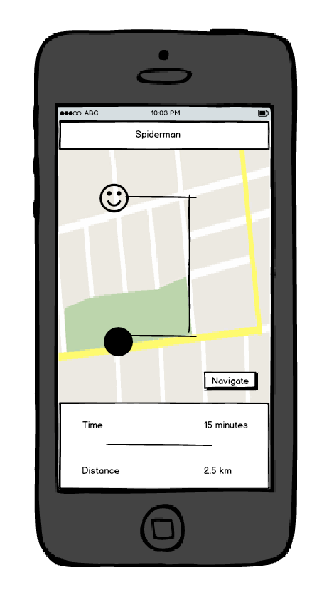

# Marvelious

# Ideas

## 1. Mobile App

+ map of characters
+ always generating in vicinity
+ choose one
+ route set
+ arrive in destination radius
+ collect character and unlock related characters

### Sketches

### Wireframes

### Prototype

### Storyboard

## 2. Web App

## Prototypes

## Personas

#### Primary

#### Secondary

#### Negative

#### Supplemental

